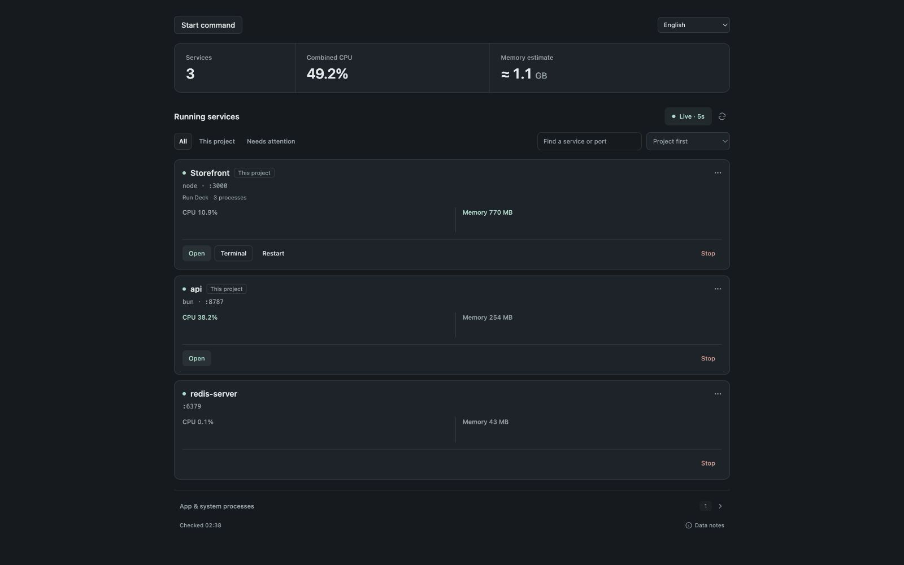

# Run Deck

[](https://github.com/DarinRowe/run-deck/actions/workflows/ci.yml)
[](LICENSE)

**See what’s running. Open it. Stop it.** A focused service dashboard for Muxy on macOS.



*Actual UI with synthetic fixture data and a simulated Muxy interface. [Light theme](public/assets/screenshot-light.png). English, Simplified Chinese, French, German, Spanish, Brazilian Portuguese, and Korean are supported. Choose a language from the header menu; your choice is remembered.*

## Everyday use

Open Run Deck to see services listening on TCP ports, including those started outside Muxy. Related listeners and child processes share one row. Current-worktree services appear first; known app and system processes stay collapsed.

- **Open** takes you to the service in Muxy’s browser. HTTP/HTTPS and the listening address get useful defaults; database ports do not get misleading web buttons.
- **CPU and memory** include observed child processes. A compact overview shows development-service totals; sort by CPU or memory to find heavier services. The highest values are marked **Top**.
- **Terminal** jumps to the exact terminal for a Run Deck launch. **Restart** stops its verified process tree, checks that it exited, then runs the saved command once in a new terminal. Previous terminal output remains available.
- **Stop** requests a normal exit for the verified process tree and checks the result. Remaining processes or another listener on the same port are reported explicitly.
- **Details (···)** reveals the process tree, individual resource values, directory, ports, and a saved launch command when known. Expand **Custom browser address** to specify HTTPS, another port, or a path. **About these readings** explains measurement limits once for the whole view.
- **Start command** lists the current worktree’s project commands with a **Start** button on each row. `dev`, `start`, and `serve` appear first; build, test, and other scripts stay under **Other scripts**. Each row shows the command to run; expand it to inspect the script body. Non-root directories remain visible. The project path and branch are available under **Working directory**. The root `package.json` supplies scripts; its `packageManager` selects npm, pnpm, Yarn, or Bun, with lockfiles as a fallback. Saved commands remain visible and reuse their terminal association. **Custom command** lets you save and run a command with a name and relative directory. Commands run through `/bin/sh` in a Muxy terminal, including commands that need keyboard input.

**Live · 5s** checks while the panel is visible, with only one inspection in flight. Hide the panel to pause; return to resume. Dialogs and actions also pause the timer. The control lets you disable or resume live checks, and **Refresh** is the single manual check. Worktree changes trigger a fresh check and pause live mode so a different execution host is not polled unexpectedly.

**Needs attention** filters sustained observations: CPU at least 80% for 30 seconds, RSS growing by at least 100 MiB and 25% over 30 seconds, or three observed listener replacements within two minutes. Brief spikes do not trigger these hints. History stays in memory, covers foreground observations only, and resets after gaps. These are signals to inspect, not health checks or memory-leak diagnoses. No operating-system notifications or automatic recovery actions are sent.

CPU is the recent average reported by macOS `ps` and may exceed 100%. Memory is summed resident memory (RSS), shown in decimal MB/GB; shared pages may be counted more than once, so totals are labelled **estimate**. Missing values show **—**. **Top** compares development services and is not an anomaly warning. See Apple's [ps documentation](https://github.com/apple-oss-distributions/adv_cmds/blob/main/ps/ps.1) for measurement definitions.

## Install

Download `run-deck-0.3.0.zip` and `SHA256SUMS` from the [v0.3.0 release](https://github.com/DarinRowe/run-deck/releases/tag/v0.3.0). Verify the download, then extract it:

```sh
shasum -a 256 -c SHA256SUMS
unzip run-deck-0.3.0.zip
```

In Muxy, choose **Extensions → Load Unpacked** and select the extracted `run-deck/` folder. The ZIP is an unsigned local installation package; Node is not required to run it. See the [release notes](docs/releases/0.3.0.md) for the new languages and dashboard refinements.

### Build from source

Use Node 20.19+ on the 20.x line, or Node 22.12+ (Node 22 or 24 recommended):

```sh
npm ci
npm run build
```

Load the generated `dist/` folder in Muxy. Follow [Load or reload that build](docs/MUXY-DEVELOPMENT.md#2-load-or-reload-that-build) for first installation, existing installations, and verification after rebuilding.

Tested in Muxy 1.6.0. Node is required only for building; the installed panel uses vanilla JavaScript and macOS utilities.

## Consent and scope

Muxy asks before executing a scan or a stop command. To avoid repeated scan prompts, choose **Allow & remember** for the read-only inspection. Muxy remembers that exact scan; stopping a process uses a separate command. Cancelling or failing a scan pauses live checks, and old results are marked stale with actions disabled. **Refresh** retries once; **Resume live** re-enables the timer. If an automatic request takes focus for consent, live mode pauses after that request to avoid repeated prompts. Muxy does not expose whether a grant was remembered; the panel explains how to resume.

Before the first default browser opening, a confirmation shows the execution host so you can confirm it is this Mac or has appropriate port forwarding. That choice is remembered for the host’s current boot session. Muxy’s extension interface does not reliably expose whether execution is local or remote, so Run Deck does not guess. An explicitly entered custom URL needs no extra host confirmation.

Services are discovered on the current **execution host**. Native inspection currently requires macOS; a Linux SSH host returns an explicit error. TCP listeners are snapshots, not health checks, and non-listening jobs are outside this view.

## What Stop does

Stop rechecks the host boot identity, current user, root PID, complete descendant membership, each process’s start time and executable, and the complete listening-port set after Muxy consent. It rechecks each identity again before sending `SIGTERM` to that positive PID. There is no process-group signal or `SIGKILL`. Trees with more than 64 processes, incomplete identities, other users’ processes, or known app/system members cannot be stopped here. Processes outside the current worktree require an additional confirmation.

Restart is available only when a live launch marker matches a saved Run Deck command in this worktree. Directories, terminal titles, and port numbers never establish that association. A final preflight after startup consent checks that the old identities are gone and ports are still free. An uncertain launch is never retried automatically. External services remain inspectable and stoppable when verified; their unknown commands are not guessed.

macOS does not provide an atomic process-handle signal through this interface. Identity and membership checks reduce risk but cannot prevent every scheduling race or track detached/reparented workers. Supervisors can restart processes later. Run Deck reports the immediate verification result; it does not automatically restart failed services. A terminal link remains separate from service health.

## Permissions and privacy

| Permission | Purpose |
| --- | --- |
| `panels:write` | Show the service panel. |
| `projects:read`, `worktrees:read` | Identify the active worktree and label its services. |
| `commands:exec` | Inspect listener trees and resources; stop verified processes for user-requested Stop/Restart. |
| `storage:read`, `storage:write` | Save commands, terminal links, custom URLs, and browser-host choices. |
| `tabs:read`, `tabs:write` | Start commands in Muxy terminals and revisit their output. |
| `files:read` | Discover package scripts and the package manager. |
| `browser:write` | Open the selected service URL. |

No telemetry, uploaded process data, external font downloads, or remote code loading. Inspection uses a temporary private file that is removed when the scan finishes. Launch markers are extracted on the host; full process arguments and environments are not sent to the panel. Each saved launch has a foreground shell wrapper for identity tracking; there is no daemon, background extension runtime, or copied terminal-log buffer. Custom URLs and saved command text stay in Muxy’s extension storage; avoid putting credentials in commands or URLs.

## Development

```sh
npm ci
npm run check
npm run dev
```

Open `/tests/preview.html` on the development server for the real UI with synthetic data. Add `?theme=light`, `?empty=1`, or `?error=1` to exercise common states. The preview never executes shell commands.

`npm run check` runs model/controller tests, a production build, and distribution assertions. On macOS it also starts disposable multiport servers and worker trees, verifies refusal of changed identities/membership, stops those trees, restarts a tracked launch, and checks occupied-port refusal. CI defines Node 20.19/22/24 checks and a separate macOS integration job.

Read [Contributing](CONTRIBUTING.md), [Architecture](docs/ARCHITECTURE.md), [Validation](docs/VALIDATION.md), and the [release workflow](RELEASE.md).

## License

[MIT](LICENSE) © 2026 DarinRowe.
