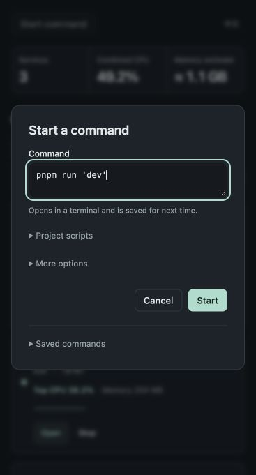
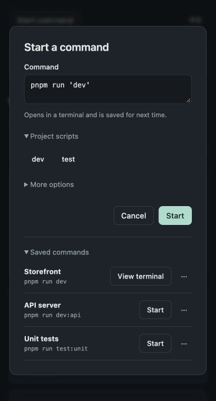
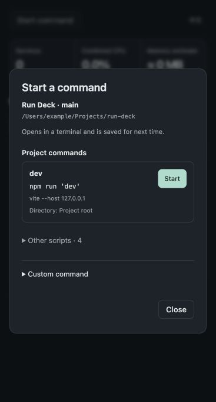
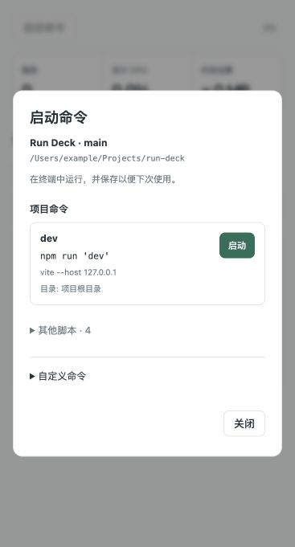
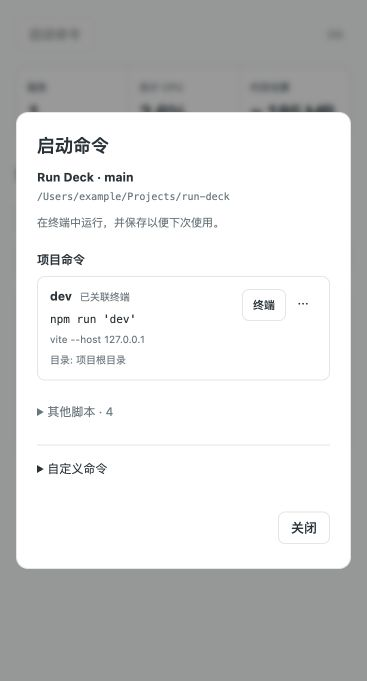
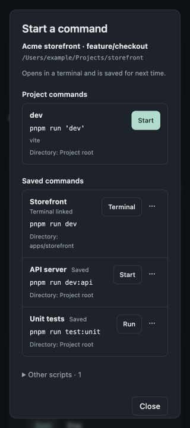
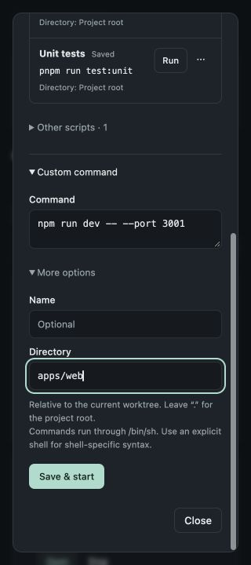

# Start a command — UX review and implementation

Reviewed September 24, 2026. Scope: the existing Run Deck command dialog, with the production UI and a fake Muxy host. Screenshots were captured and inspected during this review. The new Run Deck example reads this repository’s real package.json; project paths and terminal operations are simulated.

The highest-value change is to put executable project commands in front of the user. The previous implementation could already discover scripts, but presented a command-writing form. This hid the capability most useful to someone who simply wants to start a service.

## Captured flow

1. **Open the original dialog — functional, but discovery is hidden.** The command field receives a default `dev` script and keyboard focus. That makes custom entry straightforward, but the visible surface provides neither the project/directory nor the script body. Project scripts and saved commands are both collapsed.

   

2. **Expand project scripts and saved commands — usable, with extra navigation.** Script buttons only fill the form; users then press Start. Saved commands sit below the main form actions, making them appear secondary even for repeat use. Saved rows show no directory, so two similar commands in different packages are difficult to distinguish. The original flow correctly distinguishes a linked terminal from an available launch action.

   

3. **Open the new project-command dialog — direct and contextual.** The project, branch, and worktree path are visible. `dev`, `start`, `serve`, and their colon-prefixed variants appear above other scripts, ordered with exact `dev` first. Each row shows the literal invocation, script body, directory, and its own Start button. Opening the dialog still requires one click; once open, a command starts with one click. There is no automatic launch merely from discovering files.

   

4. **Use the Chinese/light version — clear at the normal narrow panel width.** The same hierarchy fits without horizontal clipping. Less frequent scripts and custom entry stay behind named disclosures. Script names and command bodies remain literal project content rather than translated guesses.

   

5. **Reopen after launching — reuses the existing association.** The row changes to Terminal and shows the saved link. Equivalent literal script invocations, such as `npm run dev` and `npm run 'dev'`, match within the same directory. The project row absorbs its saved counterpart instead of duplicating it. A missing or uncertain terminal remains blocked until the user reviews it and explicitly forgets the link.

   

6. **Read saved commands at 320px — usable, with vertical scrolling.** Custom names, commands, directories, and terminal links remain visible. Content wraps inside the row. The dialog scrolls vertically when several commands are saved; the Close button stays available. A terminal link is never labelled “running” because an open terminal does not prove a live service.

   

7. **Enter a custom command at 320px — functional and accessible by keyboard.** The user can enter parameters, an optional display name, and a relative directory. Input remains available while script discovery is pending. A late discovery result neither replaces a draft nor steals focus. Reading failure offers Retry and custom entry; no root package.json is treated as an empty result rather than a permission failure.

   

## Decisions and boundaries

| Decision | Reason |
| --- | --- |
| Keep Start command as a secondary dashboard action | Run Deck’s primary job remains showing and controlling observed services. The dialog now makes launching direct without turning the service list into a configuration screen. |
| Show service-like script names first; collapse other scripts | A service launcher should make `dev` easier to reach than `build` or `test`. Classification comes from script names, not a claim about actual process behavior. |
| Use packageManager, then existing lockfile inference | An explicit supported package-manager declaration takes precedence over leftover lockfiles. No package installation or manager download is performed. |
| Reuse saved command + directory | Repeated clicks should not create duplicate records or fresh copies of a linked launch. Arguments and different directories remain distinct. Only literal package-script quoting is normalized. |
| Keep root-only discovery | It is fast, read-only, bounded, and already supported by the host interface. Recursive monorepo discovery, Makefiles, Docker Compose, and multi-service orchestration require separate scope and decisions. Custom commands cover other runtimes now. |
| Preserve uncertain launch intent | A timeout is not proof that a terminal never opened. Retry must retain the association and guide the user to review it. |

This repository’s detected primary service command is `npm run 'dev'`, whose script is `vite --host 127.0.0.1`. `build`, `test`, `benchmark`, and `check` are available under Other scripts. Nothing is hardcoded to Run Deck in production; the preview has a separate query option for demonstrating its real scripts with a fake host.

## Verification

- `npm run check`: 82 tests passed, production build and distribution checks passed; approximately 77.6 KiB HTML/JS/CSS, no new runtime dependency.
- Browser lifecycle checks: close/reopen during list/stat/read; no further reads or detached rendering after closing; live checks resume while an old discovery remains pending.
- Browser launch checks: repeated project/saved-row clicks open exactly one terminal; dismissal is blocked during a pending action; uncertain custom launch retry creates one record and one opening attempt.
- Browser recovery checks: pending discovery preserves custom input and focus; read failure explains the problem and Retry succeeds; missing package.json still permits custom commands; worktree changes disable stale actions.
- English/dark and Chinese/light visual inspection; 320px saved-list and custom-form layouts have no horizontal overflow. Native dialog semantics, labelled fields, named row actions, Escape handling, and return focus are retained.

Limits: browser UI checks use synthetic host operations and do not certify native Muxy consent/focus behavior. The automated suite includes its existing disposable native-process checks, but this review did not interactively reload and launch the new UI in Muxy. A subsequent [native development-workflow check](../VALIDATION.md#native-development-workflow-verification--2026-09-24) verified real reloading, launch, terminal navigation, browser opening, stop, and cleanup against its recorded build. Screenshot inspection does not establish full accessibility conformance. Storage has no cross-window transaction; the duplicate-start guard serializes operations inside this panel instance. Externally launched processes without a verified association cannot be deduplicated by matching command text.
