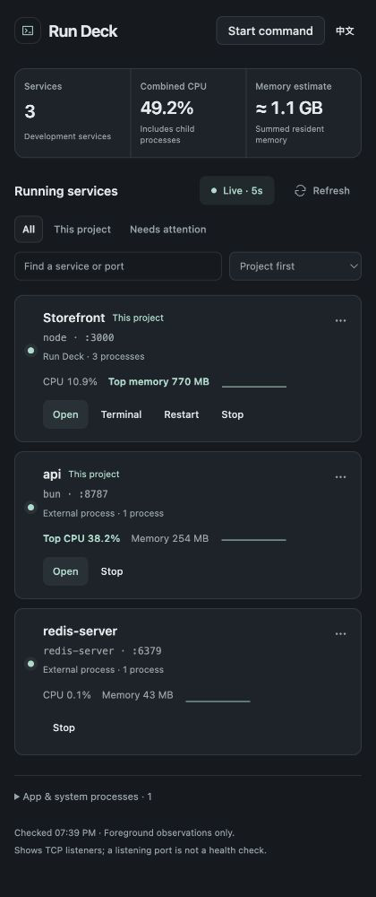
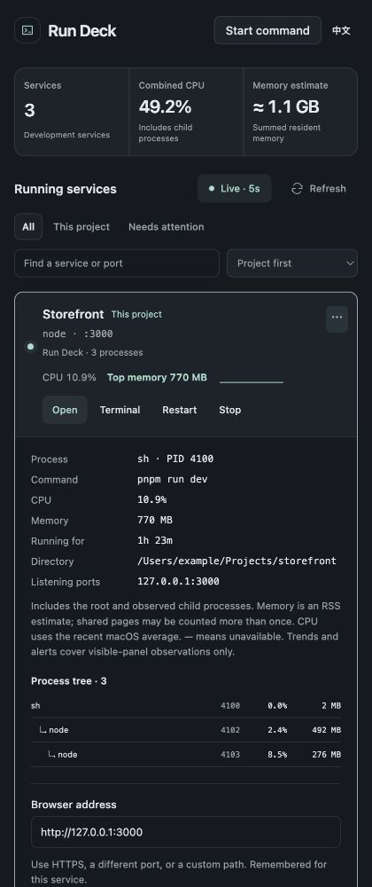
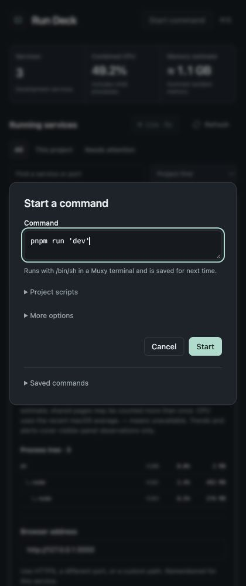
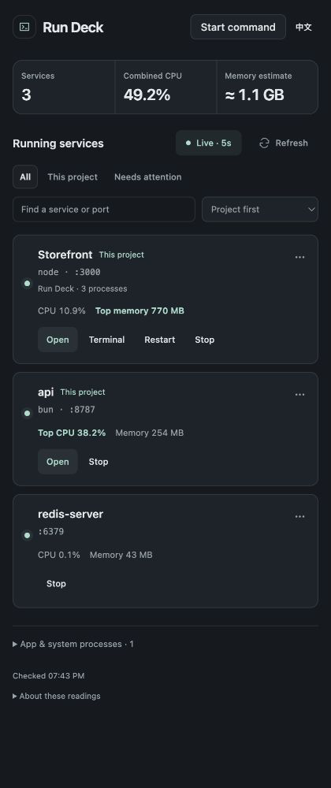
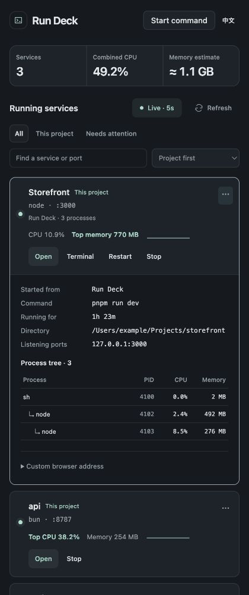
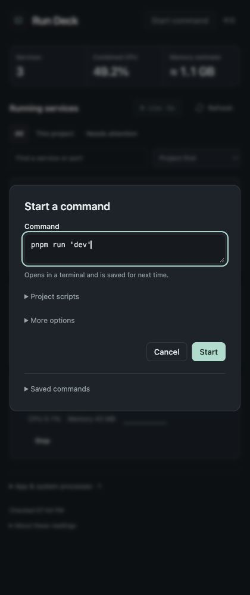

# Focused UX audit — 2026-09-24

Scope: the service overview, expanded details, and Start command dialog. Goal: reduce recurring low-value information while keeping resource use and frequent actions visible. Captured the production UI with a synthetic Muxy adapter in the Codex in-app browser, at a 420 × 1000 desktop panel size. No real services are controlled by this harness.

## 1. Service overview — functional, but repetitive

Open/Terminal/Restart/Stop are easy to find, and resource maxima are visible. However, overview helper lines restate their labels, single external processes each spend a line saying “External process · 1 process,” and Redis repeats its name above the port. The footer always displays implementation caveats. Pausing live mode also shows a grant instruction even when the user deliberately paused it (confirmed in code).

Keep meaningful source/multiple-worker context, collapse single-process boilerplate, move measurement explanations to one accessible disclosure, and reserve permission guidance for an interrupted automatic check. Keep errors, incomplete-data notices, and resource alerts visible.

## 2. Service details — too much repetition

Details repeat aggregate CPU/RSS already visible directly above and repeat a long measurement explanation for every service. The process tree has no column headers, so identifying the numbers requires prior knowledge. A default URL editor appears even when the normal Open action is sufficient.

Retain command, directory, uptime, addresses, and process membership; add semantic table headers. Put custom URL editing in a disclosure and name its action “Save & open” so its purpose differs from the primary Open action.

## 3. Start command — clear main action, unnecessary shell detail

The default project command is prepared and the Start action is clear. The shell implementation appears in the first helper sentence even though most users only need to know the command will run in a terminal and be saved. Move `/bin/sh` information into More options, where users specifying unusual commands can still find it. Give saved-command overflow controls an accessible name tied to their command.

## Evidence limits

Screenshots establish information density and visible hierarchy, not full WCAG compliance. DOM inspection supplements the screenshots for labels, table semantics, and disclosure behavior. Keyboard focus and narrow-panel layout are checked after changes. The real process-control engine is unchanged by this pass; its native verification is recorded separately in [Validation](../VALIDATION.md).

## Results

All three audited steps were simplified and checked in the same browser harness. Routine pause no longer displays permission guidance. Filtering to This project suppresses repeated project tags. Important resource values, known sources, multi-process counts, alerts, and failure states remain available. The stop-result copy now also describes remaining workers accurately, even if no process is still listening.

### 1. Overview — improved

### 2. Details — improved

The table has a caption and column headers, and indentation distinguishes child depth. Custom browser address is collapsed until requested. Save & open updated the main Open target to the entered HTTPS URL in the fake adapter. Aggregate values remain visible above the expanded details.

### 3. Startup — improved

The common form explains only the user-facing outcome. More options retains shell compatibility guidance. Saved-command overflow controls identify the command in their accessible names.

### Validation

- `npm run check`: 53 tests passed; production build/distribution checks passed. Final copy changes were rebuilt afterward.
- English/Chinese at a 420 px desktop panel: no horizontal overflow. Light/dark at 1600 × 1000: visually inspected.
- Verified routine pause, project-filter tags, measurement-help disclosure, advanced shell help, and saved-command accessible labels.
- Screenshot evidence is synthetic preview data; native process control was not altered by these presentation changes.
