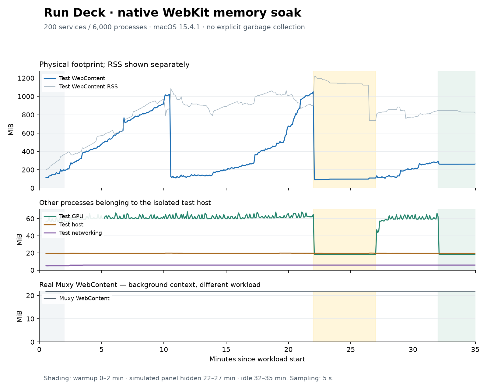

# Native WebKit memory validation

Measured on 2026-09-24 (America/Los_Angeles), using an immutable production build in a native macOS WKWebView. This is a bounded 35-minute synthetic stress test, not evidence about multi-day uptime or incremental Muxy extension overhead.

A later [performance re-audit](../performance-reaudit/README.md) fixed a distinct-scan retention issue reproduced in Node/V8. Native WebKit data probes did not reproduce it; the historical full-UI measurements in this report remain unchanged and are not claimed to have improved.

A subsequent [attribution investigation](attribution/README.md) reproduced a 1.36 GiB peak in a standalone DOM page with no Run Deck code or process fixtures. Ordinary refresh controls stayed much smaller. This rules out treating this historical peak as proof of a plugin-specific leak; it does not establish that the production peak is fixed.

## Result

The run completed all five phases in **2101.5 seconds**, with **1,384 refresh cycles**, **11,072 detail expansions**, and zero browser errors. Hidden events caused **zero scans and zero DOM mutations**. At cycle boundaries, the sampled DOM settled at 4,667 elements with no attached detail bodies after closing; the per-cycle DOM bound also passed. Temporary expanded detail nodes are not included in those boundary counts. The same WebContent PID survived the run; all four test-owned processes exited afterward.

The run did not demonstrate unbounded growth, but it also does not establish low memory use: the footprint peaked at about **1.03 GiB**, and idle RSS remained substantial.

| WebContent measurement | Physical footprint (MiB) | RSS (MiB) |
| --- | ---: | ---: |
| Sampled peak, entire run (peaks can occur at different times) | 1050.0 | 1220.8 |
| Final two minutes of hidden phase, median | 98.2 | 1122.5 |
| Final two minutes of idle phase, median | 261.0 | 829.3 |
| Last live sample | 264.0 | 815.7 |

| Other test-owned process | Peak footprint (MiB) | Last live footprint (MiB) |
| --- | ---: | ---: |
| GPU | 68.0 | 18.2 |
| Networking | 5.9 | 5.9 |
| Native test host | 19.9 | 19.3 |

Real Muxy WebContent remained at 21.8–21.9 MiB footprint under its separate background workload. That is contextual evidence, not the cost of the 200-service stress test or the extension's incremental overhead.



The graph reports live processes only. Shutdown values are not used to demonstrate in-process reclamation.


## Environment and evidence

Apple M1 Pro, 16 GiB RAM, macOS 15.4.1 (arm64), system WebKit build 20621.1.15.11.10. The workload ran from 2026-09-25 04:13:38 to 04:48:40 UTC (September 24 local time).

- [Summary and analysis windows](summary.json)
- [Workload and visibility log](workload.ndjson)
- [Raw kernel samples, gzip](memory.ndjson.gz)
- [Parent-to-helper attribution](process-attribution.txt) and [exit verification](process-exit.json)
- [Tested source and production bundle hashes](source-manifest.json)
- [Vector chart](memory.svg)

Medians use equally spaced five-second samples. The hidden/idle summaries use seconds 1,500–1,620 and 1,980–2,101 respectively. The browser log records actual transitions, which can lag nominal boundaries slightly. No memory-after-exit samples are included in the summary.

## Workload and measurement

The workload has five phases: two minutes of warmup, twenty minutes of active churn, five minutes of simulated panel hiding with incoming events, five minutes of active recovery, and three minutes of idle time. The same WebContent process must survive the entire run.

Live polling is disabled so each stress cycle has a controlled explicit refresh. Each active cycle refreshes 200 services containing 6,000 processes, opens eight service details (240 process rows), closes them, and performs three searches with synchronous layout. Every fifth cycle replaces all process identities. The workload checks that the new identity is actually rendered, closed details leave no attached body, the total DOM stays bounded, and no browser errors occur. Fake-host call logs are cleared each cycle. Requests operate only on synthetic processes.

The fake Muxy foreground callback drives panel hiding. The native window stays visible and the Mac stays unlocked, so the hidden phase tests Run Deck's suppression of work, not macOS background process eviction. The fixture restores its foreground callback after switching applications outside the hidden/idle phases; it does not override document visibility or animation frames. A stalled animation-frame wait fails after ten seconds.

Physical footprint and RSS are sampled every five seconds using macOS `proc_pid_rusage` (`rusage_info_v0`). The graph and main results use physical footprint; RSS is plotted separately. Measurements come from the same identified PIDs, associated with the native parent through `launchctl print pid/<parent>` service entries. Kernel process start times detect PID reuse. Peaks are sampled peaks; spikes shorter than five seconds can be missed. PID attribution completed before sampling began at about 32 seconds, so startup memory before that point is not covered. There are 414 live samples per process, with UTC timestamps aligned to workload elapsed time.

The native host uses public WKWebView APIs, a nonpersistent data store, a 420 × 900 window, and a local HTTP server serving the frozen build. There is no Vite/HMR, explicit garbage collection, Web Inspector, `leaks`, or `vmmap` in the decisive run. Earlier locked and diagnostic attempts are excluded.

The WebContent measurement includes production rendering, fixture generation/serialization, and the browser engine. It cannot assign every byte to production code. The real Muxy WebContent process is sampled separately as background context; it has a different workload and is not a control for incremental extension cost. No system memory pressure limit was imposed.

## Interpretation

Two large footprint drops occurred without explicit garbage collection or process replacement: **1,021.4 → 126.0 MiB** between 04:24:06 and 04:24:11 UTC, and **1,050.0 → 92.3 MiB** between 04:35:37 and 04:35:42 UTC. The second interval straddles the transition into the hidden phase; temporal coincidence does not establish that the focus change caused collection.

RSS did not fall with footprint to the same level. The final idle footprint was about 261 MiB, above the earlier hidden median of 98 MiB; final idle RSS was about 829 MiB. These are remaining high-water costs in this stress scenario, and should not be concealed by reporting only the lower of the two metrics. The observed plateaus and footprint drops do not prove that every detached object has been collected or that multi-day growth is absent.

Apple distinguishes charged footprint from resident pages, which can include clean/reclaimable memory. WebKit also documents returning unused allocator pages through its scavenger. Those mechanisms can explain why the metrics differ, but this run did not collect the region breakdown or retaining paths needed to assign the observed gap to a specific cause. See [Apple's memory accounting explanation](https://developer.apple.com/videos/play/wwdc2022/10106/) and [WebKit allocator internals](https://docs.webkit.org/Deep%20Dive/Libpas/Internals.html).

The synthetic workload creates and serializes 6,000 new fixture processes per cycle and deliberately replaces 200 cards every five cycles. It is much more allocation-heavy than keeping a few stable services open. A matched fixture-only/allocation profile would be needed before attributing its peak to a particular production module. No additional production cleanup or caching abstraction is justified by these measurements alone.

An automatic fall in process footprint demonstrates reduced charged memory during this workload, but does not establish that all corresponding resident pages disappeared or identify a particular garbage-collection phase. WebKit documents multiple collection phases and separates JavaScript, native page, layer, and image memory; retained-object diagnosis requires more than a process memory curve. See [JavaScriptCore garbage collection](https://webkit.org/blog/12967/understanding-gc-in-jsc-from-scratch/) and [WebKit memory debugging](https://webkit.org/blog/6425/memory-debugging-with-web-inspector/).

A preliminary experiment explicitly cleared detached card/detail references in an isolated copy. It did not show an early memory improvement, so that extra cleanup was not applied to production. This pass adds repeatable measurement tools and evidence, without changing production behavior.

## Reproduce

Use macOS with the Xcode command-line tools and Python 3. Keep the Mac unlocked and the test window visible. Build before starting, then serve an immutable copy so development reloads cannot reset the process halfway through the run.

```sh
npm run build
soak_dir=$(mktemp -d /tmp/run-deck-memory.XXXXXX)
mkdir -p "$soak_dir/site"
cp -R dist src tests "$soak_dir/site/"
xcrun swiftc -O scripts/webkit-memory.swift -o "$soak_dir/RunDeckMemory"
python3 -m http.server 5188 --bind 127.0.0.1 --directory "$soak_dir/site" >"$soak_dir/server.log" 2>&1 &
server_pid=$!
```

Verify that the fixture URL responds successfully before launching the host. Use a different free port consistently if 5188 is occupied.

```sh
curl --fail --silent 'http://127.0.0.1:5188/tests/preview.html?build=1' >/dev/null
"$soak_dir/RunDeckMemory" 'http://127.0.0.1:5188/tests/preview.html?build=1' 2100 >"$soak_dir/workload.ndjson" 2>"$soak_dir/host.stderr" &
host_pid=$!
```

Once the workload log contains its first `phase` record, get the host-owned WebKit PIDs. The following script prints only the service entries needed for attribution and writes the labels consumed by the sampler:

```sh
python3 - "$host_pid" "$soak_dir/pids.json" <<'PYCODE'
import json, re, subprocess, sys
pid = int(sys.argv[1])
listing = subprocess.check_output(['launchctl', 'print', f'pid/{pid}'], text=True)
labels = {'isolated-host': pid}
for line in listing.splitlines():
    match = re.fullmatch(r'\s+(\d+)\s+\S+\s+com\.apple\.WebKit\.(WebContent|GPU|Networking)\..*', line)
    if match:
        label = 'isolated-' + match[2].lower()
        if label in labels:
            raise SystemExit(f'Multiple {label} processes: inspect ownership before sampling')
        labels[label] = int(match[1])
        print(line.strip())
if 'isolated-webcontent' not in labels:
    raise SystemExit('WebContent is not ready; retry after the first workload phase')
with open(sys.argv[2], 'x') as output:
    json.dump(labels, output)
PYCODE
python3 scripts/sample-webkit-memory.py "$soak_dir/pids.json" "$soak_dir/memory.ndjson" --seconds 2160 --interval 5
wait "$host_pid"
kill "$server_pid"
```

The native host exits automatically on `finished`, errors, content-process termination, or its watchdog. Samples after process exit may contain an error or zero footprint; exclude them from live-process summaries. A valid run must contain all five phases and a `finished` record, zero hidden scans/mutations and browser errors, an unchanged process identity, and no document visibility/stalled-frame failures. A short run of at least 90 seconds can check the harness, but does not replace the full soak.

The scripts are diagnostic tooling and are excluded from the shipped extension. The full-run workload itself is the validation of the browser harness; `node --check`, Python parsing, Swift compilation, and the distribution check validate the supporting files.
