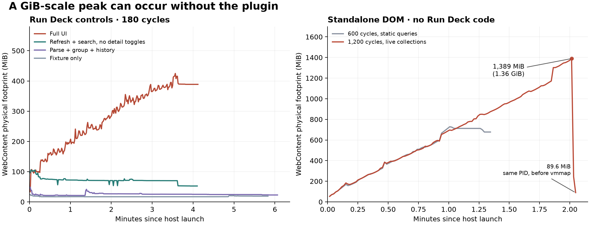

# Attribution of the WebKit high-water mark

Measured on September 24, 2026 (local time), Apple M1 Pro / 16 GiB, macOS 15.4.1, system WebKit 20621.1.15.11.10. No production code was changed by this investigation.

**The historical 1,050 MiB footprint is not evidence of a Run Deck-specific leak.** A standalone page with no Run Deck imports, no fake Muxy adapter, no process data, and no static DOM queries reached **1,389.3 MiB (1.36 GiB)**. The same WebContent process then fell to **89.6 MiB**, before any additional diagnostic tool was attached. This establishes that a similar high-water pattern can occur without the plugin. It does not establish identical retaining paths in both programs, prove that this is a particular WebKit defect, or prove the absence of a smaller application leak.

The application controls narrow the large growth to repeated detail expansion/collapse in this workload. They do not support blaming ordinary service refresh or the data/history pipeline. Several plausible cache changes failed to eliminate sustained growth and were rejected rather than added to production.

## Completed application controls

Each fresh native process used the historical soak's immutable production bundle, 200 services / 6,000 processes, 180 cycles, and 30 seconds of final idle time. UI cycles target 1,200 ms. Full UI cycles replace all service identities every fifth cycle, open/close eight details containing 240 process rows, and execute three searches with synchronous layout. The prototype omitting the URL form changes one production attachment statement and retains the original test queries.

| Control | Actual duration | Peak footprint | Final idle footprint, median of last 10 seconds |
| --- | ---: | ---: | ---: |
| Full UI | 246.1 s | 424.8 MiB | 388.7 MiB |
| Fixture generation/serialization only | 349.6 s | 24.5 MiB | 19.0 MiB |
| Fixture + real parsing/grouping/history | 364.3 s | 48.4 MiB | 22.8 MiB |
| UI refresh/search/identity changes, no detail toggles | 246.3 s | 105.7 MiB | 52.5 MiB |
| Full UI, URL forms not attached | 246.3 s | 347.6 MiB | 307.3 MiB |

The no-detail arm settled around 70–75 MiB during active refreshes. The data arm retained 200 history keys and its latest 200 service results. The fixture arm consumed the generated string's length; it does not replicate real host-bridge encoding. The data arm covers parsing/grouping/history, not every asynchronous `ServiceMonitor` or real Muxy bridge operation.

WebKit coalesced timers on the blank-page controls. Their nominal cadence matches, but their actual rate is lower; these are workload-isolation results, not precise percentage savings under identical timing. These short controls also do not repeat the historical 35-minute hidden/recovery phases. The original 1,050 MiB remains a measured stress peak, not a measurement of normal Muxy usage.



## Independent DOM reproduction

The small page creates eight native `details` elements. A cycle attaches eight 30-row tables and URL forms, expands and collapses the details, then removes the bodies. It waits for real animation frames and targets a 100 ms cycle. Only the eight summaries remain afterward: 21 attached elements total. There is no production bundle, parser, history, storage, terminal integration, or retained array of old bodies.

| Standalone probe | Cycles | Duration including 20 s idle | Uninstrumented peak footprint |
| --- | ---: | ---: | ---: |
| Static queries for row/body assertions | 600 | 80.6 s | 728.3 MiB |
| Live collections for assertions and native heartbeat | 1,200 | 142.4 s | 1,389.3 MiB |

The second run deliberately removes `querySelectorAll()` from both the page and the heartbeat. It still crosses 1 GiB. Therefore, the historical high-water mark cannot be explained solely by static query-result snapshots or by plugin-specific data retention.

For the second run, the kernel samples show the same PID/start identity throughout:

| UTC timestamp | Footprint |
| --- | ---: |
| 06:46:51.600 | 1,389.3 MiB |
| 06:46:52.610 | 243.3 MiB |
| 06:46:53.614 | 89.6 MiB |

No explicit GC, memory-pressure notification, navigation, or process replacement occurred. A diagnostic `vmmap -summary` started only at **06:46:53.811 UTC**, after all three samples above. Later samples are excluded from uninstrumented comparisons. Its [post-workload output](post-workload-vmmap.txt) showed a large resident WebKit allocation arena but much smaller dirty/allocated memory. It is not a breakdown of the earlier peak or an object-retaining-path trace.

The distinction between footprint, allocated bytes, and RSS matters: freed or reusable pages can remain resident. Apple's [memory accounting explanation](https://developer.apple.com/videos/play/wwdc2022/10106/) and WebKit's [memory inspection guide](https://docs.webkit.org/Infrastructure/MemoryInspection.html) describe those separate measures. The measurements suggest substantial reclaimable allocation under DOM pressure; they do not identify which collection/allocator phase caused the drop.

## Rejected interventions

Four exploratory runs were initially scheduled for 600 cycles but stopped deliberately after an asserted prefix demonstrated continued growth. They are **not completed 600-cycle validations** and their stop-time peaks are not comparable as fixed-workload improvement percentages.

| Intervention | Last fully verified cycle count | Peak observed before stopping |
| --- | ---: | ---: |
| Replace only harness static queries with live collections | 225 | 425.8 MiB |
| Pool at most 256 process rows | 255 | 465.8 MiB |
| Cache detached detail bodies: at most 8 bodies / 256 rows | 225 | 379.7 MiB |
| Keep that bounded cache attached inside collapsed `details` | 195 | 384.1 MiB |

All retained the original input scale, identity churn, detail interactions, and search operations. The attached-cache probe allowed up to eight closed detail bodies in its DOM assertion; its last boundary count was 6,115 elements. Other probes ended cycles with no attached detail bodies. Individual shorter samples sometimes looked better, but none established elimination of the high-water behavior. No cache, form removal, or query substitution was adopted.

An upstream [StaticNodeList memory-accounting change](https://github.com/WebKit/WebKit/commit/27813d31905562646dbe49b2e0cc3473ca3a3bfe) made the query hypothesis worth testing. The negative live-query controls mean it cannot be cited as the established cause here. No claim is made about which Safari release includes that change.

## Decision and remaining work

Keep the current bounded history, lazy detail creation, keyed card updates, five-second foreground scheduling, and hidden-work suppression. Do not add an unproven cache, periodically reload the panel, lower all scan frequencies, or use forced GC to make a chart look smaller. The data-only and no-detail controls do not justify those changes.

If comparable memory pressure occurs during ordinary use, the next useful evidence is a matched real-Muxy panel-visible/closed or enabled/disabled comparison in the same workspace, plus an allocation/JS-DOM retaining-path capture at high water. Use this standalone reproducer for a WebKit-version comparison or upstream investigation. A proposed production mitigation must preserve the same visible workload, pass real Muxy interaction checks, and lower peak footprint **and** settled memory over a full-length run. Neither a higher GC rate in a short run nor a smaller Node heap is sufficient.

This investigation identifies a reproducible trigger and rejects unsupported attribution/optimizations. It does **not** claim that the 35-minute production peak has been fixed, that WebKit is universally at fault, or that the plugin is leak-free.

## Evidence and reproduction

- [Summary, timestamps, and intentional early-stop records](summary.json)
- [Raw kernel samples](memory.ndjson.gz) and [workload/visibility logs](workload.ndjson.gz)
- [Process attribution and exit verification](process-exits.json): all 44 test-owned host/helper processes exited
- [Source, bundle, and native-host hashes](manifest.json)
- [Exact baseline site](baseline-site.tar.gz), [control probe](control-probe.mjs), and rejected [patches](patches/)
- Independent probes: [live collections](minimal-live.mjs), [static queries](minimal-static.mjs), [HTML](minimal.html), and [native host](minimal-host.swift)
- [Vector chart](comparison.svg)

All measurements use fresh native hosts sequentially, the same system WebKit, a nonpersistent data store, real animation frames, a visible 420 × 900 window, and per-PID kernel start identities. Memory is sampled once per second; shorter peaks can be missed. All recorded visibility and browser-error assertions passed. There was no forced GC, Web Inspector, memory-pressure simulation, or engine-version change. Only the explicitly marked post-workload `vmmap` diagnostic differs. Normal machine activity and allocator timing were not controlled, and each arm has one run.

For the independent live-query reproduction, run from the repository root on an unlocked Mac. Use a free port consistently if 5198 is occupied. Start the server first:

```sh
probe_dir=$(mktemp -d /tmp/run-deck-dom-probe.XXXXXX)
mkdir -p "$probe_dir/site/tests"
cp docs/webkit-memory/attribution/minimal.html "$probe_dir/site/blank.html"
cp docs/webkit-memory/attribution/minimal-live.mjs "$probe_dir/site/tests/webkit-soak.mjs"
xcrun swiftc -O docs/webkit-memory/attribution/minimal-host.swift -o "$probe_dir/MemoryHost"
python3 -m http.server 5198 --bind 127.0.0.1 --directory "$probe_dir/site" >"$probe_dir/server.log" 2>&1 &
server_pid=$!
```

Verify that the server responds successfully before launching the host:

```sh
curl --fail --silent 'http://127.0.0.1:5198/blank.html' >/dev/null
"$probe_dir/MemoryHost" 'http://127.0.0.1:5198/blank.html' 1100 >"$probe_dir/workload.ndjson" 2>"$probe_dir/host.stderr" &
host_pid=$!
```

Use the [existing PID-attribution and kernel-sampling instructions](../README.md#reproduce), with `--interval 1`, to sample this host. The probe itself completes 1,200 cycles plus 20 seconds idle in about 2.5 minutes; `1100` is the native watchdog input, not a requested 18-minute workload. Do not run `vmmap` or force GC when comparing the uninstrumented curve. Wait for the host and stop only this test server afterward:

```sh
wait "$host_pid"
kill "$server_pid"
```

For the application controls, extract `baseline-site.tar.gz` into an empty temporary site, use the existing repository `scripts/webkit-memory.swift` host, and select a URL below. Its archived `tests/webkit-soak.mjs` is the attribution probe, not the original 35-minute workload.

| Arm | URL path |
| --- | --- |
| Full UI | `/tests/preview.html?build=1&arm=full` |
| Fixture only | `/blank.html?arm=fixture` |
| Data pipeline | `/blank.html?arm=data` |
| No details | `/tests/preview.html?build=1&arm=no-details` |

The default is 180 cycles at a target 1,200 ms cadence plus 30 seconds idle. Keep the archived build and fixture together. The patches and manifest preserve rejected variants for inspection; none belongs in the shipped extension. The standalone case is a faster way to reproduce a comparable WebKit peak, not a replacement for real Muxy validation.
